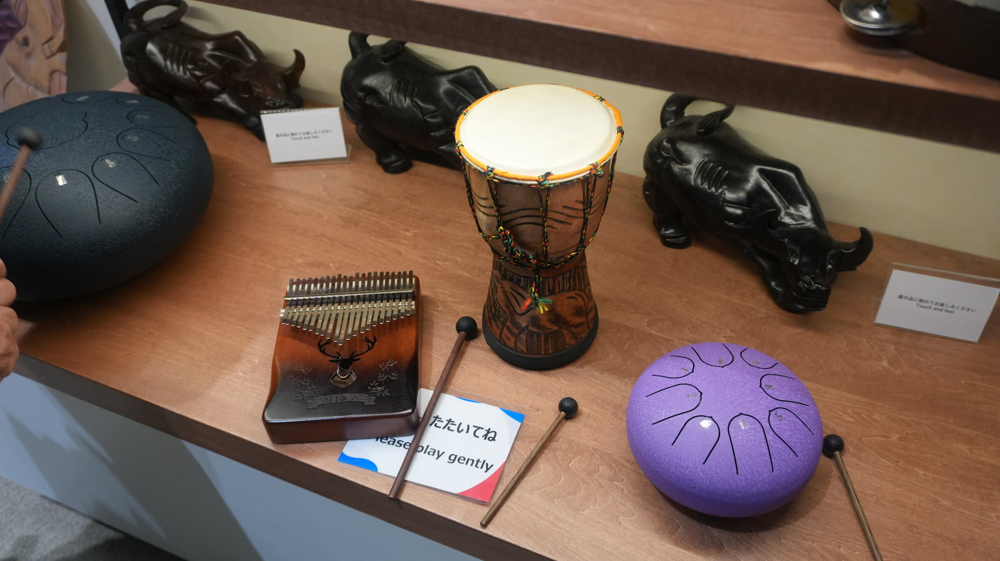
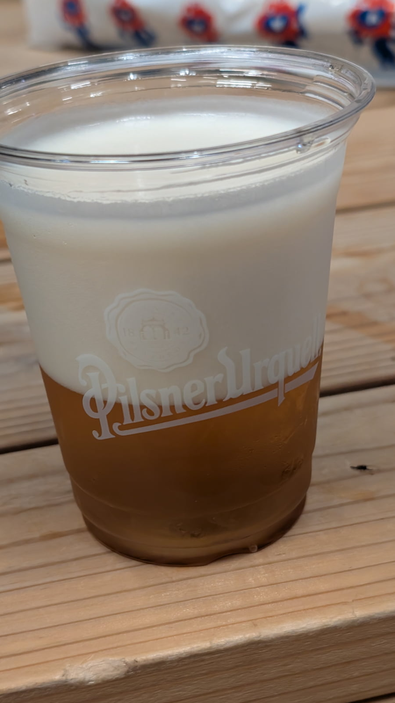
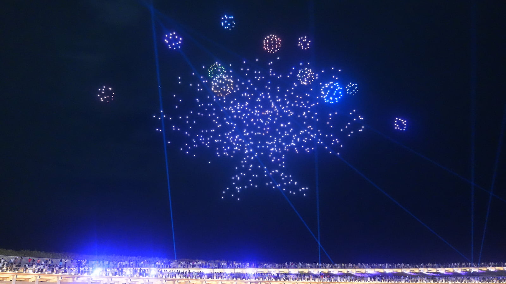

6月6日に大阪万博に初めて行った時のログです。もう2ヶ月近く経ってる……  
散歩でもするか！と、予約も情報収集もせず、夕方からふらっと行きましたが楽しかったです。

## 回ったパビリオン・イベント
- コモンズ-D
- チェコパビリオン
- ドローンショー

## コモンズ-D
- 知らない楽器がいろいろあっておもろかった
- カリンバとかタングドラムとか知ってる楽器もちょこちょこ見かけた
- カリンバすき

## チェコパビリオン
- ピルスナーウルケルを飲みに行った
- 建物綺麗だった
- たまたま入ったタイミングでイベントをやっていて、バレエ『カプリッチョ』が観れた
- ウルケルはいつだっておいしい

## ドローンショー
- きれいだった
- 最後まで見た結果帰りが破滅した

うっかり年パス買ってるので、もっと行きたいけど暑くてつらい

